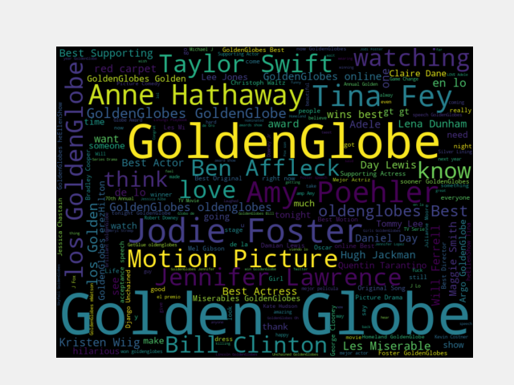
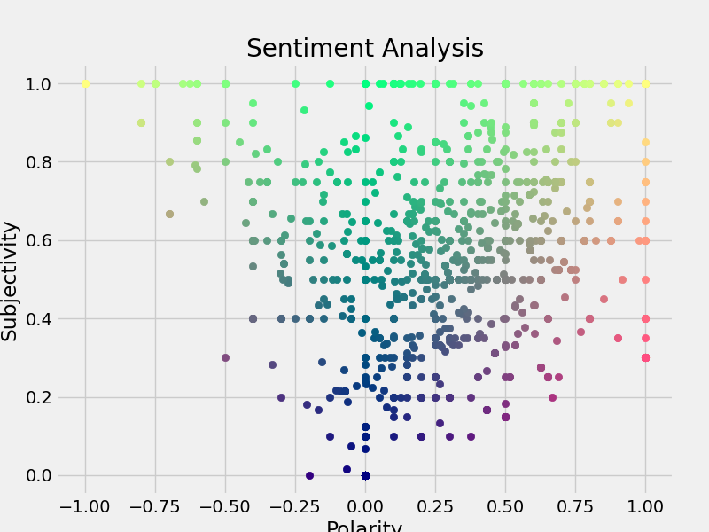
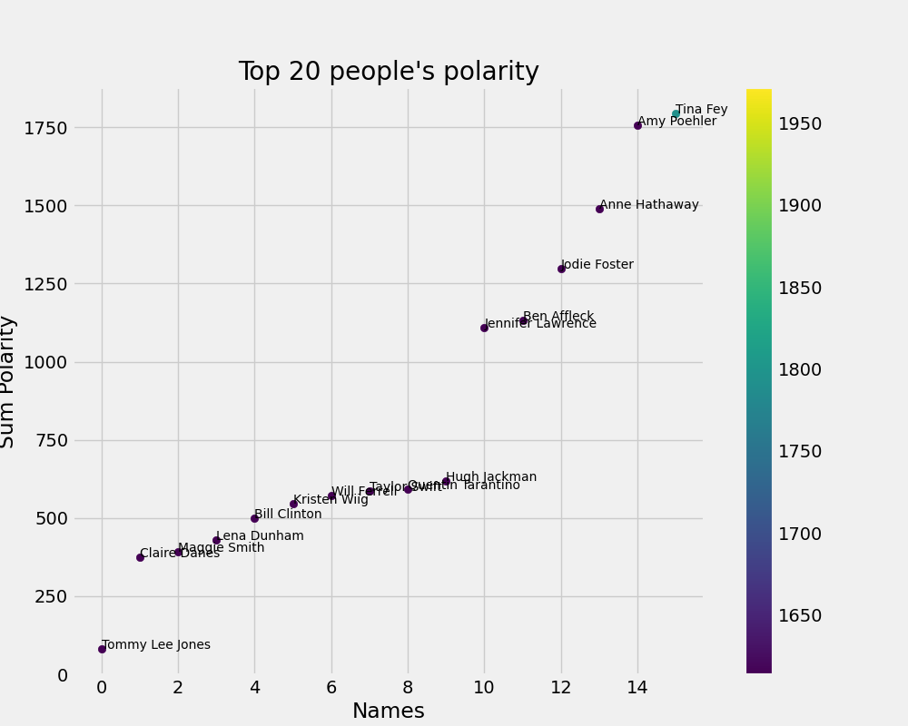
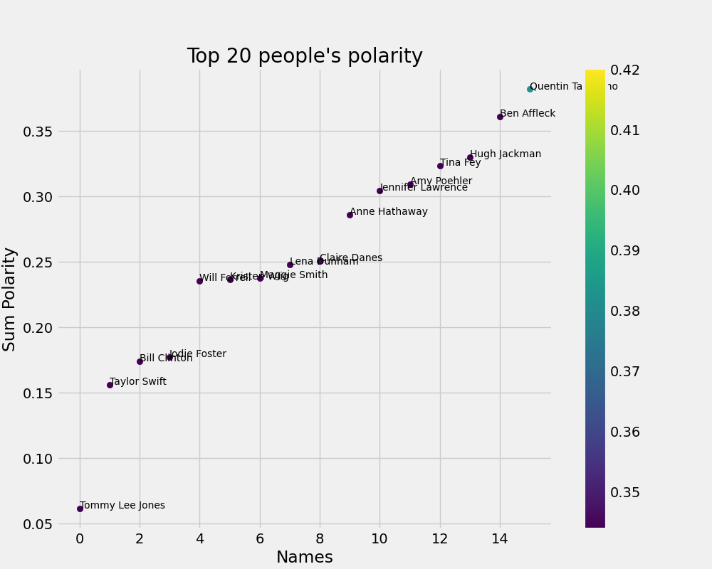

# gg-project-master
Golden Globe Project Master
Group 2
Members: Jerry Xu, Daniel Wang, Jonathan Katz
Github Link: https://github.com/JerryXRQ/CS337_Project1

The packages necessary to run our code are included in the file final_requirements.txt. We also included a file named final_requirements_katz.txt that worked on a different system. Please switch to that one in case the first one does not work. Additionally, the following packages might require separate installation.

For spacy, we need to install en_core_web_sm via
pip install https://github.com/explosion/spacy-models/releases/download/en_core_web_sm-2.3.1/en_core_web_sm-2.3.1.tar.gz.
Newer versions of this module seemed to have difficulty identifying people as effectively.
For nltk, we need to add the names files with the command python -m nltk.downloader names and the vader tools with command python -m nltk.downloader vader_lexicon.
For textblob, we need to download necessary data by running python -m textblob.download_corpora.

To run the autograder, simply use the command python autograder.py (+year). To get the json output, please use the command python gg_api.py (+year). If a year is not provided to gg_api, the code will run 2013 by default. The result will be stored in the same directory as the code.

To make the runtime more manageable, we enabled multiprocessing in our code. The multithreading is performed in gg_api.py on tasks nominee, winner, and presenter. In case multiprocessing cause problems when running our code, we included the single-threaded version of gg_api.py. By replacing everything in gg_api.py with the content of gg_api_single_thread.py, the code will run in single-threaded mode.

We also included some different approaches we have attempted for the tasks. For nominees.py, we created selected sets of movie names, TV series names, actor names, actress names, and director names, which were used to match the content of the tweets. However, because of the runtime requirements, we could not use it in our final submission. This method should be able to improve the overall performance on that task. You can see our attempt in nominee-modified.py. Note these datasets are derived from the IMDb publicly accessible datasets found at https://datasets.imdbws.com/ with documentation for the datasets at https://www.imdb.com/interfaces/.

We also created a weighting system for task nominee which was also excluded in the final version due to the excessive calculation. Such algorithm tries to assign a score for each pair of (tweet, award) using some basic text analysis and learning and acquire nominees for a certain award by sorting all potential nominees in weighted tweets scores. You can find this such algorithm in 'nominee weighted algorithm.py'.

The extra tasks we attempted include the following.

## Humor Detection

We implemented humor detection. This code finds the people who made the best jokes through keyword search. It also includes a naive attempt at finding the subject of the joke by finding common elements in the selected tweets.

To run the code, use the command python humor.py. You can add a year after the input to control which year the code runs on. If that input is not provided, it will choose 2013 by default.

## Red Carpet - Best Dressed and Worst Dressed

We implemented best dressed and worse dressed analysis. This code uses keyword search and sentiment analysis to find the best and worse dressed. It also finds the most discussed person on Twitter. Additionally, we integrated Bing downloader to directly find pictures of the selected people online. However, this service is not stable. If the code detects errors, it will print "Something when wrong when retrieving images from Bing". Other functions should always run normally.

To run the code, use the command python red_carpet.py. You can add a year after the input to control which year the code runs on. If that input is not provided, it will choose 2013 by default.

## Parties - Best Party Hosts

We implemented a program that tracks the most discussed parties of a given year. However, because the source data only includes a small time segment, many parties were not recorded. Therefore, the quality of data produced was limited.

To run the code, use the command python parties.py. You can add a year after the input to control which year the code runs on. If that input is not provided, it will choose 2013 by default.

## Sentiment Analysis - Sentiment towards a Person

We implemented a program that evaluates the sentiment score of the public for a given person in a given year. It returns a score that reflects the average sentiment. A positive value reflects positive sentiment and a negative value reflects negative sentiment.

To run the code, use the command python sentiment_analysis.py. You need to add a year and a name after the file name to control which target the code runs on.

## Sentiment Analysis - General Sentiment Analysis for Common Subjects

We implemented a code that scans all the tweets for positive and negative sentiment. It will look for positive words and tweets, negative tweets, and neutral tweets, producing representative samples with top subjectivity and/or polarity. Additionally, it will create a word cloud plot of common words and a corresponding sentiment score and polarity plot. The color of the words in the word cloud is mapped to the ones in the sentiment plot. We have included the 2013 result as a reference (see 'wordcloud.png' and 'PolarvsSub.png').

Wordcloud.png

Polar vs Sub.png

To run the code, use the command python sentiment_analysis_general.py. You can add an optional year input. If it is not provided, then 2013 will be selected by default. The plot is designed to be saved in a folder called sentiment. However, the tool does not create the folder automatically. Please make sure that this folder is created in advance.

Sample output omitted due to excessive length.

## Act - Most recognized acts

We implemented a code that scans all tweets for most popular people and for each of them we created a action map that finds the most recognized acts he/she performed during the golden globes. The program returns action initiator as well as their top popular actions in a list.

Sample output:   
"jodie foster ['coming speech', 'dying jodie', 'get jodie']  
amy poehler ['opening monologue', 'exciting clintons', 'comes torture']  
tina fey ['opening monologue', 'drinking game', 'got school']"  

## Loved - Most loved people by social media

We implemented a code that perform sentiment analysis for top popular people. For each person, we calculate a polarity score based on each related tweets and rank them in descending order. We also generates two plots ('TopPolarity-Avg.png' and 'TopPolarity-Sum.png') to visualize the interrelationship between top popular people and their score. Finally, we combine those two plots to produce our final output for most liked people by social media.

To run the code, use the command python Loved.py. You can add an optional year input. If it is not provided, then 2013 will be selected by default. The plot is designed to be saved in a folder same as Loved.py.

Sample output: "People most loved by social media: ['Tommy Lee Jones', 'Claire Danes', 'Maggie Smith', 'Lena Dunham', 'Bill Clinton']"

Top Polarity - Sum.png

Top Polarity - Avg.png

# Work Distribution

### Jerry Xu:
Developed the framework of the program including data and utilities.
Wrote the code for all the basic requirements.
Added extra task humor detection and red carpet.
Tested all the code, wrote README file, and compiled the submission

### Daniel Wang:
Wrote tasks 1) sentiment analysis general, 2) acts, and 3) social media popularity analysis (loved).
Developed the weighting algorithm for nominee.
Contributed in the writing and formatting of README file as well as the submission compilation.
Helped tune the performance of the code.

### Jonathan Katz:
Added extra task party detection and sentiment analysis for a given person.
Helped test the code and write the README file.
Gathered data for actors, actresses, directors, and movies
Attempted an alternative approach for nominee.py.

# Some reference performance:

Because we use sampling, the scores we get tend to be not stable. The following are results from four consecutive runs. It should reflect our average-case performance.

Test Environment: Harley Server
Run Time: 4 min 20 s
Performance:
'2013': {'hosts': {'spelling': 1.0, 'completeness': 1.0}, 'awards': {'spelling': 0.7511796676639619, 'completeness': 0.25270270270270273}, 'nominees': {'spelling': 0.44193672993673, 'completeness': 0.0823452380952381}, 'presenters': {'spelling': 0.44999999999999996, 'completeness': 0.33749999999999997}, 'winner': {'spelling': 0.6682692307692307}}

'2015': {'hosts': {'spelling': 1.0, 'completeness': 1.0}, 'awards': {'spelling': 0.7476993027915592, 'completeness': 0.3157142857142857}, 'nominees': {'spelling': 0.39444444444444443, 'completeness': 0.09447142857142858}, 'presenters': {'spelling': 0.4391025641025641, 'completeness': 0.3173076923076923}, 'winner': {'spelling': 0.6399161735700198}}

Run Time: 4 min 20 s
Performance:
'2013': {'hosts': {'spelling': 1.0, 'completeness': 1.0}, 'awards': {'spelling': 0.7650073118497129, 'completeness': 0.22368421052631576}, 'nominees': {'spelling': 0.4774006862702516, 'completeness': 0.10399999999999998}, 'presenters': {'spelling': 0.44999999999999996, 'completeness': 0.33749999999999997}, 'winner': {'spelling': 0.6682692307692307}}}

'2015': {'hosts': {'spelling': 1.0, 'completeness': 1.0}, 'awards': {'spelling': 0.755095752495701, 'completeness': 0.32499999999999996}, 'nominees': {'spelling': 0.4340493966817497, 'completeness': 0.08358333333333333}, 'presenters': {'spelling': 0.4978438228438229, 'completeness': 0.31794871794871793}, 'winner': {'spelling': 0.6314102564102565}}

Run Time: 4 min 10 s
Performance:
'2013': {'hosts': {'spelling': 1.0, 'completeness': 1.0}, 'awards': {'spelling': 0.7650073118497129, 'completeness': 0.22368421052631576}, 'nominees': {'spelling': 0.4103342454646803, 'completeness': 0.0865142857142857}, 'presenters': {'spelling': 0.48846153846153845, 'completeness': 0.3548076923076922}, 'winner': {'spelling': 0.6682692307692307}}

'2015': {'hosts': {'spelling': 1.0, 'completeness': 1.0}, 'awards': {'spelling': 0.755095752495701, 'completeness': 0.32499999999999996}, 'nominees': {'spelling': 0.3805630970336853, 'completeness': 0.09313571428571428}, 'presenters': {'spelling': 0.49337307991154145, 'completeness': 0.35929487179487174}, 'winner': {'spelling': 0.6314102564102565}}}

Run Time: 4 min 20 s
Performance
'2013': {'hosts': {'spelling': 1.0, 'completeness': 1.0}, 'awards': {'spelling': 0.7650073118497128, 'completeness': 0.22368421052631576}, 'nominees': {'spelling': 0.4528458208458208, 'completeness': 0.0878095238095238}, 'presenters': {'spelling': 0.44999999999999996, 'completeness': 0.33749999999999997}, 'winner': {'spelling': 0.6682692307692307}}

'2015': {'hosts': {'spelling': 1.0, 'completeness': 1.0}, 'awards': {'spelling': 0.747699302791559, 'completeness': 0.3157142857142857}, 'nominees': {'spelling': 0.3508549522373052, 'completeness': 0.10345714285714287}, 'presenters': {'spelling': 0.48951048951048953, 'completeness': 0.35673076923076924}, 'winner': {'spelling': 0.592948717948718}}
